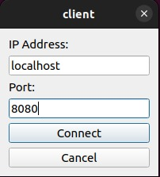
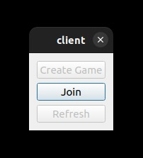

# Jazz Jackrabbit 2
Trabajo Practico final para la materia Taller de Programacion I - FIUBA

## Integrantes
* [Valentin Brizuela](https://github.com/ValentinBrizuela)
* [Isaias Cabrera](https://github.com/isaiascabreraa)
* [Pablo Mokorel](https://github.com/pablomoko)
* [Lucas Perez Esnaola](https://github.com/LucasPerezEs)

## Instalacion del proyecto
* [Instalacion](MANUAL_DE_INSTALACION.txt)

## Ejecución para el Cliente y Servidor
Servidor:
1. Abra una terminal y navegar hasta el directorio del servidor.
2. Ejecute el comando `./server <puerto>` para iniciar el servidor.

Cliente:
1. Abra otra terminal y navegar hasta el directorio del cliente.
2. Ejecute el comando `./client` para iniciar el cliente.

3. Coloque la dirección IP y el puerto del servidor para conectarse.

4. Haga clic en "Join" para unirse a una partida.

## Controles
* Mover izquierda: `A`
* Mover derecha: `D`
* Disparar: `F`
* Saltar: `Barra espaciadora`
* Golpe especial: `K`
* Sprint: `LSHIFT`
* Zoom in: `Flecha hacia arriba`
* Zoom out: `Flecha hacia abajo`

## Documentacion primera entrega
### Lo que ya tenemos
* Aplicacion Cliente y Servidor con correcta comunicacion mediante protocolos definidos
* Jugabilidad basica (movimiento, colisiones, respawns, sistema de puntos, etc)
* Fisica de los objetos
* Partidas multijugador
* Un escenario
* Animaciones para el personaje Jazz, un enemigo y drops.
* Interfaz de usuario basica
* Camara con seguimiento al jugador
* Musica de fondo y algunos efectos de sonido
* Interfaz de menu principal basica
* Archivo Vagrant para la instalacion

### Lo que nos falta por hacer
* Server con varias partidas en simultaneo
* Logica de eleccion de personaje (Interfaz, animaciones, golpes especiales, etc)
* Personajes intoxicados
* Sistema de armas y municiones
* Daño entre jugadores
* Mas formas de ganar puntos (Gemas, matando jugadores, etc)
* Mas personajes
* Mas enemigos
* Un escenario
* Menu principal mas desarrollado
* Mas efectos de sonido
* Animaciones para explosiones
* Sistema de reloj en partida
* Pantalla final con el Scoreboard
* Configuracion con YAML
* Editor de mapas
* Testing
* Cheats

## Licencia y Referencias
Este repositorio se encuentra bajo la Licencia MIT  
Implementacion de Threads, Queues y Sockets brindada por Martin Di Paola.
* [Threads](https://github.com/eldipa/hands-on-threads)
* [Sockets y Queues](https://github.com/eldipa/sockets-en-cpp)
